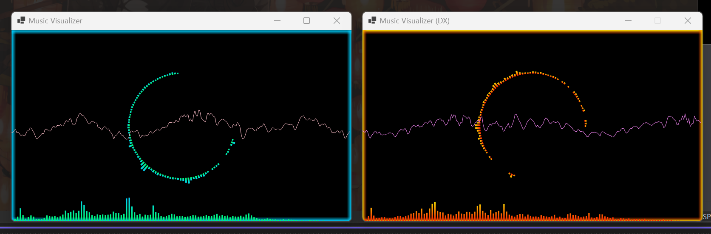
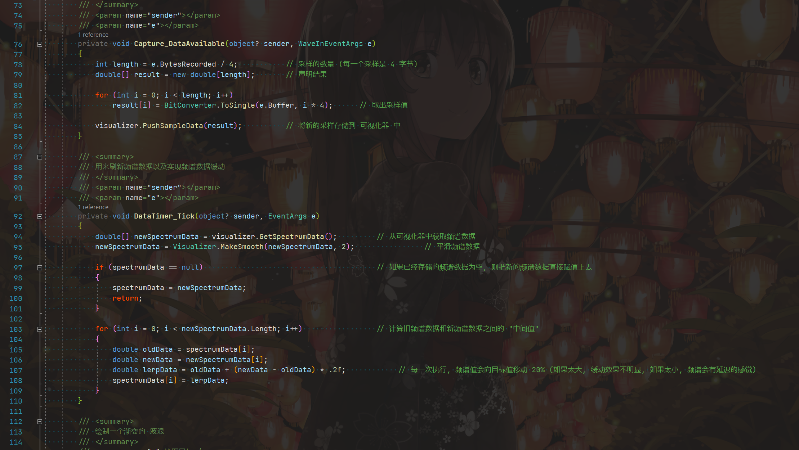

# 音频可视化器 / AudioVisualizer

分别在 GDI+ 和 Direct2D(SharpDX) 上实现了音频可视化 \
Audio visualization on GDI+ and Direct2D (SharpDX) respectively

你可以学到: 如何实现音频可视化, 如何使用 SharpDX 进行 2D 绘图 \
You can learn: how to implement audio visualization, how to use SharpDX for 2D drawing

## 主要逻辑 / Main logic

### 音频可视化 / Audio visualization

- 每一帧对旧数据和新数据进行 "渐变", 值不会立即更新为新值, 而是更新为两值的中间值, 也就是说, 每一次刷新, 数据只会 "移动" 一定比例 \
  Each frame do lerp operation between the old data and the new data, the value is not updated to the new value immediately, but is updated to the intermediate value of the two values, that is, each refresh, the data will only "move" a certain percentage
- 加个窗函数, 遮盖住低频与高频, 主要展示中间频率 \
  Add a window function to cover the low frequency and high frequency, mainly showing the middle frequency
- 将低频区域的值取出来, 单独用来做 "低音" 的视觉效果 \
  Take out the value of the low-frequency area and use it separately for the visual effect of "bass"

### WinForm

- 使用 WinForm 的 Timer 实现在单线程的定时频谱数据获取以及界面刷新 \
  Using WinForm's Timer to achieve timed spectrum data acquisition and interface refresh in a single thread

### GDI+

- 使用 BufferedGraphics 使绘制时不会闪屏 \
  Use BufferedGraphics to draw without flickering

## Enjoy

代码注释很完善, 所以, 学起来呀~ \
The code comments are very perfect, so let's just learn it~

